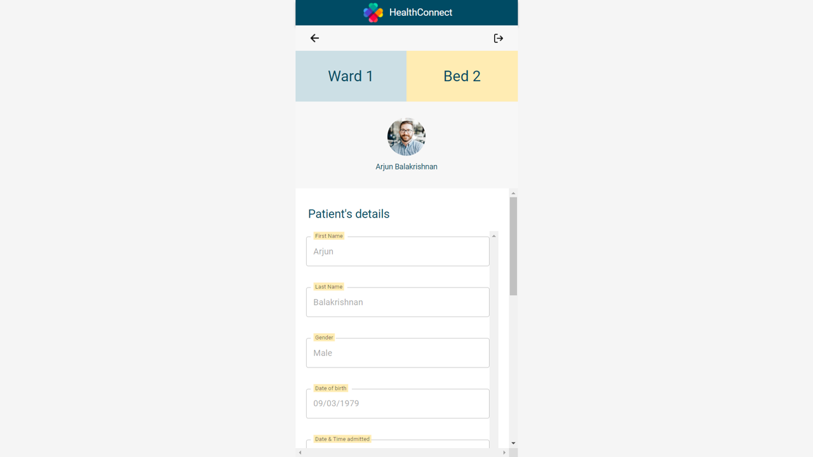

# Healthconnect

Healthconnect is a react app linking the hospital staff community to patients' families, with a chat functionality enabling faster & more responsive communication on key matters regarding the patient.
Healthconnect was brought to the development team directly by a user experience team, with a requirement to stick to their design & functionality requirements.
 

## **Description**

The App is intended to be a simple mobile app. On loading up the site, a login page allows to identify the user:

- a hospital staff: a nurse for example or
- a patient's contact or "next of kin".
   
  For sake of simplicity we hearafter refer to "staff" vs "contact".
   

Upon successful login, the user is then directed to his "flow": there is a user experience journey for staff and a separate user experience journey for contacts. 

## **Technologies used**

### M.E.R.N.

HealthConnect is a fullstack MERN app developped thanks to : MongoDB, Express, React, Node.js (ie MERN)  
[MUI](https://mui.com/) was used for styling some components.
 

### CSS

A figma was provided by the user experience team and proved valuable to ensure pixel perfect or at least very close matching to the initial design requirements.  
CSS was used for more strictly positioning & customizing elements.
 

### Material UI

<a href="mui.com" target="_blank" >Material UI</a>, a React component library, was utilized to provide more complex pre-built components to assist in the frontend development and ensure consistency across the various components.
 

### Dependencies

- FONTS:
  "@fontsource/roboto"
- MATERIAL UI & related:
  "@mui/icons-material", "@mui/material", "@mui/system", "@emotion/styled", "@emotion/react"
- Other
  "dotenv"
  "react"
  "react-dom"
   

## Installation instructions

run `npm i`  
We used a local Mongo database, but have provided .JSON files of all the required collections directly in the repo.  
The JSON files are found in [the backend repository's databases folder](https://github.com/sei43-healthconnect/backend/tree/main/databases) and will need to be manually added to your local database for the site to work.

 

## General flow & user stories

### Login

- Display the **login page** with two buttons one for **Staff** Login another for **Patient** Login (ie the patient's contact)
  

- In staff login page, the staff use their Singapore NRIC number and password to login, the assumptions being that (i) the app may be deployed on computers rather than mobile for staff, and (ii) that they don't have work phone numbers.
  
- In Patient login page, the login is done using the contact's mobile number and password.
  

- Upon successful login, the **home page** is displayed with conditional rendering of components based on the role (staff or contact).
- Users cannot access the homepage unless a role has been created ie they have logged in.
  ​ 

**_Detailed steps:​_**

1. Declare react states for roles,user and password.Set roles through the choosing of buttons either staff or patient.UseContext to save role and user.  
2. Add function handleClick to login,first fetch() call added the end points as the first mandatory parameter,second parameter takes in the request parameter(POST).  
3. Component render based on condition,if role is equal to staff, setAuthorised with staffnric and password.If role is equal to patient, setAuthorised with patient contact number and password. 
4. In return Method, use HomeLogo image, CSS for styling the page and MUI for styling the buttons. 
5. Use conditional rendering, if no role selected, show role option buttons. Once role selected shows input boxes for user and password 
6. In Login Button,onClick attribute is set to the handleLogin function as the event target. 

### Staff

After a staff has logged in he will be directed to the home page showing staff components.

In the staff's home page, the staff will be shown their staff ID, name, photo.
Also, their respective wards will be shown below their details.

- Clicking on one of these wards button, will display the details of the ward ie all the beds in the ward and the patients occupying the beds
  

- Clicking on a bed then displays more details on that bed: the name, photo of the patient assigned to that bed, together with two buttons: "send message" or "patient details".
  
- The patients details button displays the full patient details (name, date of birth, date of admission, ward & bed numbers, diet requirements, doctor remarks...: the staff can edit & save changes to the patient details)
  
  

- The send message button displays a chat box: the staff can then chat with the patient's contacts (see following section below)

**_Detailed code steps:​_**

1. Upon staff login, a state is set for the staff containing all staff details (first name, last name, photo, wards), including the wards assigned to the staff
2. A click on one of the ward triggers a backend fetch getting all the patients in that ward and populates the ward with the bed number & patient name/photo
3. Once a bed is selected, the **patient** state is set (as a useContext) allowing the corresponding components to display the chat page or the full patient details.
    

#### Staff's chat

The UX team identified thru interviews what the **Nurses/ Staff** wanted in terms of chat features:

1. to chat with various patient's contact(s) in a single chat SO THAT communication between the group of staff and group of patient contacts is clear to individual staff members.

   > ✅ Chat is tied to patient ID, and all related staff can access and send messages in the chat.  
   > ✅ All messages in the chat that are not sent by the current user have names on them.

2. to know if a message that has been sent to patient's contact(s) has been read SO THAT they can feel at ease even if there is no reply.
   > ✅ Every message comes with a 'read' checkbox next to their time stamp, and the state is saved in the database. Thus, every user can see if specific messages are read or not. To mark a message as read, a user will need to check the checkbox of the message directly - just being on the page does not mark the message as read. This helps communicate acknowledgement between parties with little effort.  
   > ✅ Users are also not allowed to send messages in the chat without first acknowledging the messages sent by the other "group" (eg. staff must acknowledge all patient contacts' messages before being able to send messages, but cannot and do not need to acknowledge messages sent by other staff).

> 3. to be able to send template messages SO THAT communication is more efficient.

### Contact

Once a contact has logged in, he is brough tto a **home page** which displays the main patient's details such as the name, hospital, ward no, bed no and the staff in charge.

A verification modal pops up when the user selects the "message staff" or the "patient's details" button.  
Upon entering the **correct** patient's NRIC, the user is directed to the "message staff"/chat or "patient's details' page.

The verification modal no longer appears once the user has submitted the correct NRIC.  
As such, on going back to the contact's home page, the user will be directed immediately to the respective pages once either button is pressed. 
All of these are conditionally rendered as well, and the pages will change depending on the buttons pressed and the correct NRIC submitted.

WHen clicking patient details, the contact can access the same Patient Details page as the nurse (see above) but cannot edit any field.

### Contact Chat

- the contact's view of the chat is almost identical to the staff's chat view: the main difference is the addition of a disclaimer message.
- the previous messages need to be acknowledged before a new message can be sent
  

## Planning and Development Process

- For this app, we started by planning the flow which very naturally followed the information provided in the figma: two distinct flows (staff vs contact)
- As the primary purpose of this app was to implement a chat function between staff and patients, and both staff and contact could access (i) the chat (ii) patient details: components needed to be accessed by both flows, posing a challenge to the navigation (see infra)
- We started very early to work on the database and backend to ensure we could test the output on the frontend with a real dataset, especially since the chat functions requires a very dynamic interaction with the database (retrieve messages, add new messages and rerender the chat box with the latest 'live' messages).
- We then started to split the work on individual components to construct the elements that would make up the landing login in page, the staff homepage, the ward details, the beds in each ward and the patient details.
- Whenever components became too complex or the code too long, we split them into further subcomponents, proping down the neededs information.
   

## Challenges

The main challenges identified were:

- how to implement a many-to-many chat
- how to implement the "msg has been read" acknowledgment
- how to implement the navigation back page
- how to structure the database to keep the collections simple yet efficient & avoid to many backend data querying

### Problem-Solving Strategy

1. To simplify the overall problems posed by a many-to-many chat (many nurses can chat with many family contacts), we simplified the relationships:

- the main key is the always the patient
- a chat is defined by a unique patient id and a unique ward number : a nurse has to be assigned to a ward and can then access each chat in that ward, a contact or NOK is automaticalaly linked to a patient

2. To access key information in the various components and avoid too much proping, the patient data and contact are stored in a useContext state which can then be accessed by each component and subcomponent:

- state is set when the staff selects a bed within a ward
- state is set directly upon login of a contact

3. The navigation to previous pages proved challenging: soem components are used by both user and contact (chat, patient details). The solution to navigating within each user's flow came from extensively using conditional rendering and storing values of the navigation in a useContext state accessible by each component: when the user is on a page, the previous page relative to that page is stored in a state to conditionally render.

4. Database structure was kept simple: 4 collections [staff, contacts, patients, chats]

- the staff collection contains all the documents with details per staff
- the contacts collection contains all patients contacts and are linked to the patient collection thru \_ID and the patient's NRIC number
- The patient collection has all the patient details (firstName, lastName, NRIC, ward number, bed number,... )
- Instead of multiplying the chat collections: a single chat collection strategy was implemented at this prototype stage, with no concerns of DB performance at this stage. All chat messages are in the same collection, with the patients ID used to retrieve only the required data subset (ie a fetch POST based on chat_ID, which references the patient's object ID )

### Unsolved problems

❌ Upon login by a staff, the staff is brought to his home page, where he/she can see all the wards under his/her watch.
There is supposed to be an add ward button that adds a ward to the staff and the new ward would then be shown in the display.
The new ward number would be added to the current staff's document in the staff collection with frontend patch & correpsonding backend patch method to the mongo db collection. We managed to get the front end working but were unable to get it to patch to the back end before the project deadline.
 
❌ The staff information in the header does not dynamically update with the current nurse in charge. We found it hard to update the name based on nurse shifts, and couldn't find a workaround for this.
 
❌ Due to time constraints, we were unable to implement a 'Quick Texts' button that would allow nurses to select from a set of template messages and change relevant information in it to quickly craft an important message that might be reused for different patients.
 

❌ There is no indication of why a user is unable to send a message at the moment as we couldn't implement a pop up due to time constraints.

#  
